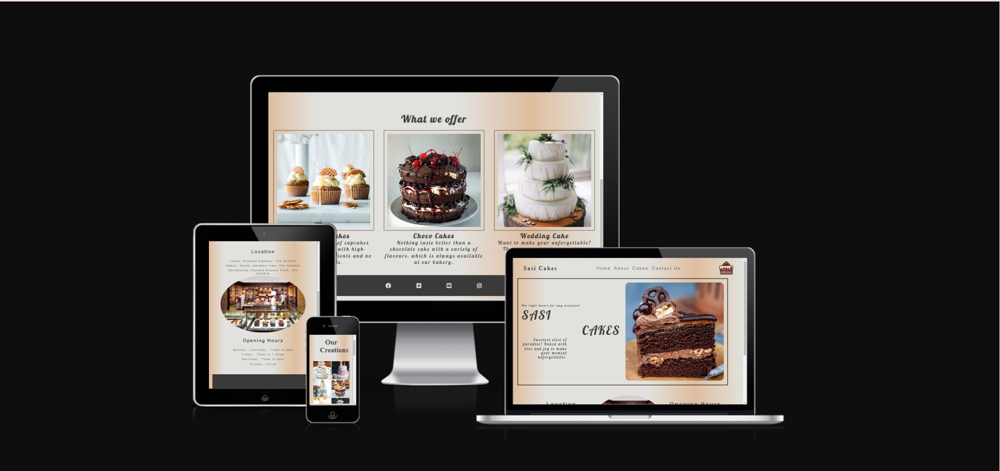
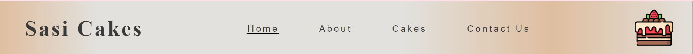
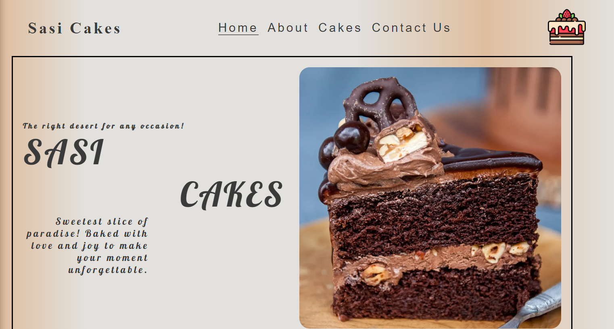
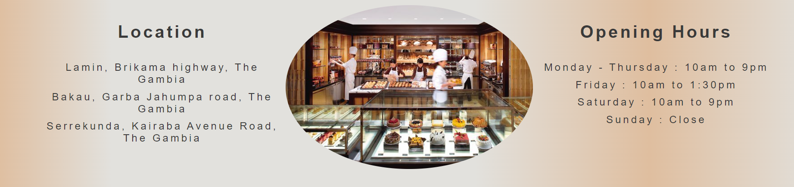
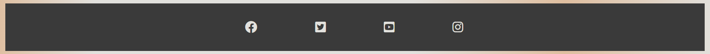
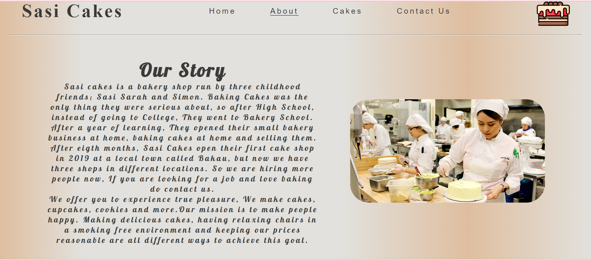
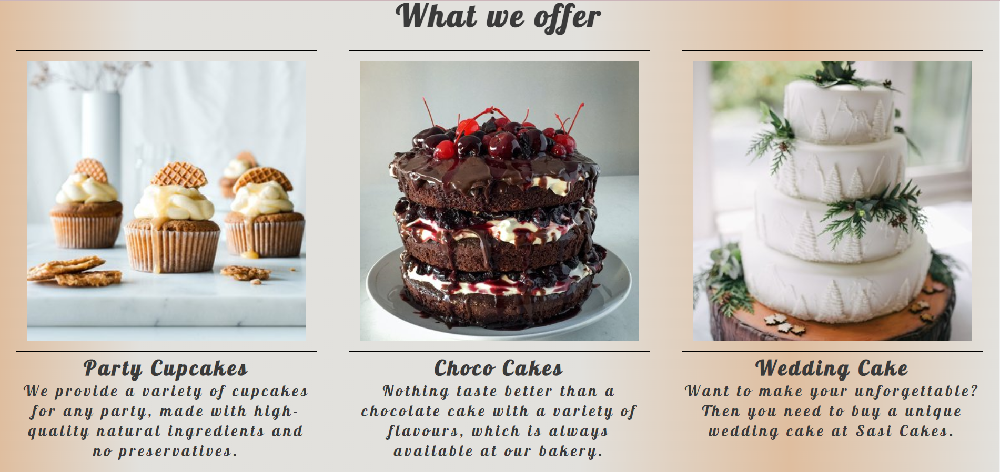
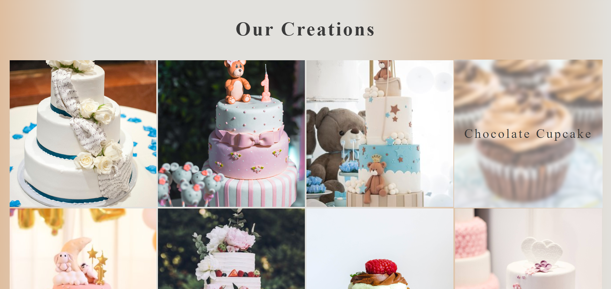
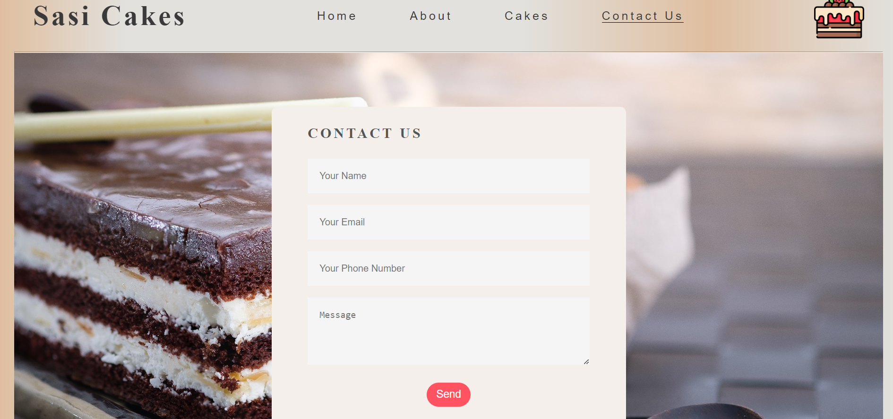
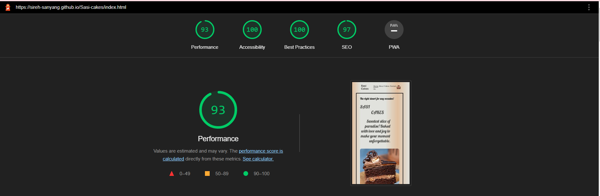

# Sasi Cakes

Sasi cakes is a cake shop located in The Gambia, using the finest and simple ingredients to bake cakes, We offer all types of cakes. The website provides its users with valueable information about the cake shop such as its location, the type of cakes we offer, opening hours, background story of the shop, a gallery with sample of cakes avaible in the shop and a form in our contact us page for users to fill if they want to contact us.

# Existing Features

## Navigation Bar

 In the navigation bar the user can find all four links to navigate through the website, Home page, About Us, Cakes and Contact Us page, and is identical in each page to allow easy navigation, It also contain the logo and a cake icon in the right.

## Home page

The landing page includes an image of a slice chocolate cake and some texts to attract the user's attention.

## The Information section

This section is found at the bottom of the home page. It contains all the information about the locations and opening times.

## The Footer

It contains links to our social media accouts, for user to contact us and review the cake shop.

## About Us

In this page there are two sections;

- ##### Upper part of the About Us page
This serction contains the story of how the cake shop started, The owners, and what motivated them, It also contain an image of some students in a bakery school.

- ##### Lower part of the About Us page
This section contains some of our unique cakes that we offer, and the rigth occasion for it.

## Cakes/Gallery

The gallery provides some images of cakes and the types of cakes to expect in our cake shop. It shows the name of the cake, when the user hover on the image.

## Contact Us
Here the user can send us a message by filling the form

## Features left To implement
 * To create an online ordering application.
 * Be able to receive messages from users.

 ## Technologies used

### HTML5
* As a structure language.

### CSS
* As a style language

### Font Awesome
* As an icon library for a social links.

### Google fonts
* As a font resource.

### GitHub
* As a software hosting platform to keep project in a remote location.

### Git
* As a version-control system tracking.

### Gitpod
* As a development hosting platform

 ## Testing

 ## Performance testing

I run [Lighthouse](https://developers.google.com/web/tools/lighthouse/) tool to check performance of the website.

I noticed that this tests scores vary from time to time.

 ### Code Validation
 At the and of the project I used two websites to validate a code
 
 * [W3C CSS Validator](https://jigsaw.w3.org/css-validator/) to validate CSS.
 * [W3C Markup Validator](https://validator.w3.org/) to validate HTML.

 ### Testing links
* All links work perfectly fine, and external links open in a separate tab in a browser.

### Responsive Testing

* Site was tested across multiple screen sizes.

 ## Deployment

This section should describe the process you went through to deploy the project to a hosting platform (e.g. GitHub) 

- The site was deployed to GitHub pages. The steps to deploy are as follows: 
  - In the GitHub repository, navigate to the Settings tab 
  - From the source section drop-down menu, select the Master Branch
  - Once the master branch has been selected, the page will be automatically refreshed with a detailed ribbon display to indicate the successful deployment. 

The live link can be found here - https://sireh-sanyang.github.io/Sasi-cakes/

## Credits

* [Web Dev Simplified](https://courses.webdevsimplified.com/)I used the link source to help me the gallery effects and form.

* To complete this project I used Code Institute student template: [gitpod full template](https://github.com/Code-Institute-Org/gitpod-full-template)

* All the images used in the website are from pexels and unsplash.

